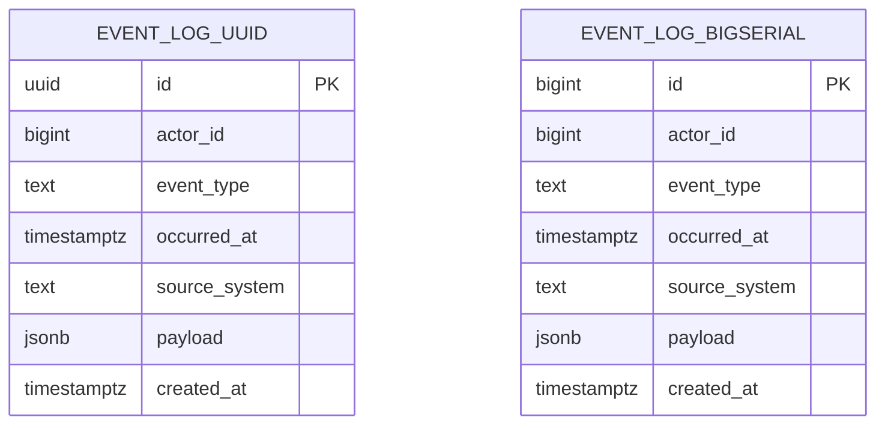

# UUID против BIGSERIAL: инженерный спор, а не религиозная война

Курс: Конструирование баз данных

Формат: эссе с техническим приложением и логами работы с AI-ассистентами

Выполнил: ____________________

Группа: ____________________

Дата: 19 июня 2026

---

## 1. Лог работы с основной AI-моделью

Основная модель использовалась не как генератор готового текста, а как
инструмент для последовательного исследования. Ниже приведены ключевые
запросы и ответы, на которых строилась работа.

### 1.1. Сбор сильных аргументов в пользу UUID

**Запрос к основной модели**

> Выступи в роли архитектора, который защищает использование UUID как
> первичного ключа в PostgreSQL. Не критикуй UUID заранее. Собери самые
> сильные инженерные аргументы в пользу UUID, особенно для современных
> распределенных систем. Отдельно укажи, какой аргумент является самым сильным.

**Ответ основной модели**

Модель выделила несколько сильных аргументов в пользу UUID.

1. UUID можно генерировать вне базы данных, поэтому сервисы, очереди,
   мобильные клиенты или отдельные контуры записи могут создавать
   идентификаторы без обращения к центральной последовательности.
2. UUID удобен при объединении данных из нескольких систем: вероятность
   конфликта идентификаторов практически исчезает без дополнительного
   согласования диапазонов.
3. UUID снижает риск простого перебора публичных URL вида `/orders/123`.
   Это не заменяет авторизацию, но уменьшает утечку информации о количестве
   записей и темпе роста бизнеса.
4. UUID удобен для outbox/event-driven-паттернов, где событие или сущность
   может появиться до записи в основную базу.
5. UUID помогает при офлайн-сценариях: клиент может создать объект локально,
   а затем синхронизировать его с сервером.

Самым сильным аргументом модель назвала глобальную уникальность без
центральной координации. Этот аргумент действительно серьезен: если несколько
независимых узлов должны одновременно создавать идентификаторы, обычная
последовательность PostgreSQL становится архитектурной точкой согласования.

**Моя фиксация после этапа**

Самым сильным аргументом я считаю именно децентрализованную генерацию
идентификаторов. Аргументы про «безопасность через непредсказуемость» и
«красивую универсальность» слабее: авторизацию они не заменяют, а
универсальность часто оплачивается лишними эксплуатационными расходами.

### 1.2. Контраргументы и альтернативы

**Запрос к основной модели**

> Возьми самый сильный аргумент за UUID: глобальная уникальность и
> децентрализованная генерация. Найди его ограничения. Предложи инженерные
> альтернативы, которые решают ту же задачу без обязательного использования
> UUID как внутреннего первичного ключа PostgreSQL.

**Ответ основной модели**

Модель предложила декомпозировать аргумент. Глобальная уникальность нужна не
всегда всей базе данных и не всегда именно внутреннему первичному ключу.
Возможные альтернативы:

1. Оставить `BIGSERIAL` или `bigint identity` внутренним ключом, а UUID
   использовать как внешний публичный идентификатор с `UNIQUE`-ограничением.
2. Использовать составной ключ или уникальное ограничение вида
   `(source_system, external_id)`, если данные приходят из нескольких систем.
3. Раздать диапазоны sequence-значений разным узлам или использовать
   `CACHE`/`INCREMENT BY` для независимых контуров, если топология известна.
4. Использовать упорядоченные идентификаторы, например UUIDv7/ULID/Snowflake,
   если важно генерировать идентификатор вне БД, но хочется уменьшить ущерб
   от случайной вставки в B-tree.
5. Разделить внутреннюю модель хранения и внешний API: внутри базы оставить
   компактный последовательный ключ, наружу отдавать отдельный непрозрачный
   идентификатор.

Модель также указала, что UUID не решает сам по себе проблему идемпотентности,
распределенных транзакций, прав доступа и дедупликации событий. Эти задачи
обычно требуют отдельных ограничений, протоколов и бизнес-ключей.

**Моя фиксация после этапа**

Главное уточнение: спор должен быть не «UUID против BIGSERIAL вообще», а
«какой идентификатор должен быть внутренним первичным ключом конкретной
таблицы». Если UUID нужен на границе системы, это не доказывает, что он должен
быть кластерообразующим и самым часто используемым ключом внутри PostgreSQL.

### 1.3. Проектирование эксперимента

**Запрос к основной модели**

> Подготовь для PostgreSQL два варианта таблицы event_log: один с UUID primary
> key, второй с BIGSERIAL primary key. Предложи сценарий массовой вставки,
> метрики сравнения и объясни ожидаемые эффекты на уровне хранения и индексов.

**Ответ основной модели**

Модель предложила две таблицы с одинаковыми полями события:

- `id`;
- `actor_id`;
- `event_type`;
- `occurred_at`;
- `source_system`;
- `payload`;
- `created_at`.

Отличие должно быть только в типе первичного ключа: `uuid` с
`gen_random_uuid()` против `bigserial`. Для сравнения следует массово вставить
одинаковое число строк через `generate_series`, включить `\timing` в `psql`,
затем сравнить:

1. время вставки;
2. размер таблицы;
3. размер первичного индекса;
4. суммарный размер индексов;
5. планы запросов с `EXPLAIN (ANALYZE, BUFFERS)`.

Ожидаемый эффект: `bigint` занимает 8 байт, `uuid` занимает 16 байт. Кроме
самого размера ключа важна локальность вставки: последовательный `BIGSERIAL`
добавляет новые значения в правую часть B-tree, а случайный UUID распределяет
вставки по разным страницам индекса. Это может увеличивать число разбиений
страниц, объем индекса и давление на кэш. При этом модель отдельно отметила,
что результат зависит от версии PostgreSQL, настроек, железа, объема данных,
типа UUID и реальной конкурентности.

**Моя фиксация после этапа**

Для технического приложения я выбрал сравнение массовой вставки и размеров:
таблицы, всех индексов, первичного ключа и дополнительного индекса
`(actor_id, id)`. Последний индекс показывает эксплуатационный эффект, когда
первичный ключ входит во вторичный индекс явно. В PostgreSQL вторичные индексы
не хранят первичный ключ автоматически как в InnoDB, поэтому этот момент важно
не преувеличивать.

### 1.4. Проверка на односторонность позиции

**Запрос к основной модели**

> Найди сценарии, где вывод «BIGSERIAL прагматичнее UUID» будет неверным или
> слишком грубым. Сформулируй границы применимости рекомендации.

**Ответ основной модели**

Модель указала, что UUID оправдан:

1. в multi-master или offline-first системах, где записи создаются независимо
   и затем объединяются;
2. в интеграционных системах, где идентификатор должен быть уникален до
   попадания в центральную PostgreSQL-базу;
3. в публичных API, если внешний идентификатор не должен раскрывать количество
   объектов;
4. в event-driven архитектуре, где событие рождается до транзакции в основной
   базе;
5. при использовании упорядоченных UUID-подобных форматов, когда часть
   проблемы случайной вставки уже смягчена.

Модель также предупредила, что аргумент в пользу BIGSERIAL наиболее силен для
одного PostgreSQL-контура записи, OLTP-нагрузки, больших таблиц, горячих
индексов и команд, которым важны простота отладки и эксплуатации.

**Моя фиксация после этапа**

Итоговая позиция не должна звучать как «UUID плох». Более точная рекомендация:
если нет реального требования к децентрализованной генерации внутреннего
ключа, `BIGSERIAL`/`bigint identity` часто проще, компактнее и
производительнее как первичный ключ PostgreSQL-таблицы. UUID может быть
отдельным внешним идентификатором или осознанным внутренним ключом там, где
его преимущества действительно нужны.

---

## 2. Лог независимой верификации второй моделью

Для независимой проверки промежуточные выводы, DDL и сценарий эксперимента
были переданы второй модели в роли критически настроенного технического
рецензента.

**Запрос второй модели**

> Проверь работу как строгий технический рецензент. Не улучшай стиль и не
> пиши финальный доклад. Попытайся разрушить позицию «BIGSERIAL часто
> прагматичнее UUID». Найди технические ошибки, логические натяжки,
> неявные допущения, проблемы в DDL и сценарии массовой вставки. Отдельно
> укажи сценарии, где вывод перестает работать.

**Краткий ответ второй модели**

Вторая модель указала на несколько рисков:

1. `run_all.sql` должен запускать не только DDL, загрузку и метрики размеров,
   но и `EXPLAIN`-часть, иначе часть доказательной базы не собирается.
2. Сравнение времени вставки смещается, если UUID всегда загружается первым,
   а BIGSERIAL вторым: порядок, прогрев кэша, WAL и состояние буферов могут
   влиять на результат.
3. Нельзя переносить выводы о случайном UUID на все UUID-форматы. UUIDv7 и
   другие упорядоченные идентификаторы уменьшают проблему локальности вставки.
4. В PostgreSQL вторичные индексы не содержат первичный ключ автоматически,
   поэтому аргумент о раздувании всех вторичных индексов из-за UUID должен
   быть сформулирован осторожно.
5. Размер sequence, создаваемой для `bigserial`, тоже нужно показать, даже
   если он мал по сравнению с таблицей и индексами.
6. `EXPLAIN`-примеры по range scan для BIGSERIAL и point lookup для UUID не
   являются симметричным сравнением; симметричным сравнением должен быть
   одинаковый запрос, например по `(actor_id, id)`.

**Наиболее ценные замечания**

Самыми ценными были замечания про порядок загрузки, про UUIDv7, про устройство
вторичных индексов в PostgreSQL и про необходимость учитывать sequence. Они
защищают работу от слишком гладкого вывода «UUID всегда медленный и раздувает
все вокруг».

**С чем я согласился**

Я согласился с тем, что нужно явно различать случайный UUID и упорядоченные
идентификаторы. Также я согласился, что в PostgreSQL нельзя механически
переносить аргумент из InnoDB о хранении первичного ключа во всех вторичных
индексах. Еще я согласился, что общий сценарий должен запускать `EXPLAIN`,
поддерживать обратный порядок загрузки и показывать размер sequence.

**С чем я не полностью согласился**

Я не считаю эти замечания опровержением основной рекомендации. Они уточняют
ее границы: если система действительно распределенная или использует
упорядоченный внешний ID, UUID-подобный подход может быть оправдан. Но для
обычной PostgreSQL OLTP-таблицы с одним контуром записи компактный
последовательный ключ остается более прагматичным стартовым выбором.

**Что изменилось после проверки**

После верификации я изменил формулировку технической части: сравнение
относится прежде всего к случайному UUID через `gen_random_uuid()`, а не ко
всем возможным UUID-подобным идентификаторам. В разделе про индексы отдельно
указано, что PostgreSQL не добавляет первичный ключ во вторичные индексы
автоматически. Кроме того, `run_all.sql` теперь запускает `EXPLAIN`, сценарий
загрузки поддерживает обратный порядок через `load_bigserial_first=true`, а
метрики показывают размер sequence. В инструкции по проверке добавлено
требование выполнять несколько прогонов и не делать вывод по одному измерению
времени.

---

## 3. Краткий комментарий к логам

На первом этапе я намеренно попросил основную модель защищать UUID, чтобы не
начинать исследование с заранее заданного вывода. Самым полезным ответом был
аргумент о децентрализованной генерации, потому что он связан не с модой, а с
реальным архитектурным требованием. Затем я попросил модель не просто спорить
с этим аргументом, а разложить его на задачи и найти альтернативы: внешний
UUID, составные ключи, диапазоны sequence и упорядоченные идентификаторы.
На этапе эксперимента модель помогла перейти от общих слов к проверяемому
сценарию с двумя таблицами, массовой вставкой и измерением размеров индексов.
При этом часть первичных формулировок была слишком широкой: модель легко
создавала впечатление, что UUID ухудшает все вторичные индексы автоматически.
После критической проверки это было исправлено: для PostgreSQL такой тезис
нужно ограничивать индексами, где UUID действительно входит в ключ или
хранится как данные. Вторая модель также справедливо напомнила про UUIDv7,
про sequence у BIGSERIAL и про то, что один запуск теста не является надежным
benchmark-выводом. После верификации итоговая позиция стала осторожнее:
работа сравнивает случайный UUID и BIGSERIAL в типовом PostgreSQL-контуре,
а не объявляет UUID плохим универсально. В итоге AI был полезен как генератор
направлений и критик, но инженерный вывод пришлось сужать, проверять и
формулировать с явными границами применимости.

---

## 4. Техническое приложение

### 4.1. Что сравнивается

Эксперимент сравнивает две таблицы журнала событий:

- `pk_benchmark.event_log_uuid` — первичный ключ `uuid`, значение по умолчанию
  `gen_random_uuid()`;
- `pk_benchmark.event_log_bigserial` — первичный ключ `bigserial`, значение
  генерируется sequence.

Обе таблицы имеют одинаковые бизнес-поля:

- `actor_id`;
- `event_type`;
- `occurred_at`;
- `source_system`;
- `payload`;
- `created_at`.

Связей с другими таблицами нет: цель эксперимента — изолировать влияние типа
первичного ключа. Искусственный внешний ключ добавил бы лишнюю переменную.

### 4.2. Ограничения

В обеих таблицах используются:

- `PRIMARY KEY`;
- `NOT NULL`;
- `CHECK (actor_id > 0)`;
- `CHECK` на допустимые значения `event_type`;
- `CHECK` на непустой `source_system`;
- `CHECK`, что `payload` является JSON-объектом.

### 4.3. Индексы

В обеих таблицах есть:

- первичный B-tree-индекс по `id`;
- индекс по `occurred_at`;
- индекс `(actor_id, id)`.

Индекс `(actor_id, id)` выбран специально: он показывает эффект ширины
идентификатора в эксплуатационном индексе, где первичный ключ входит в индекс
явно. В PostgreSQL вторичные индексы не содержат первичный ключ автоматически,
поэтому выводы нельзя переносить на все вторичные индексы без проверки их
состава.

### 4.4. DDL UUID-варианта

```sql
CREATE TABLE pk_benchmark.event_log_uuid (
    id uuid NOT NULL DEFAULT gen_random_uuid(),
    actor_id bigint NOT NULL,
    event_type text NOT NULL,
    occurred_at timestamptz NOT NULL,
    source_system text NOT NULL,
    payload jsonb NOT NULL DEFAULT '{}'::jsonb,
    created_at timestamptz NOT NULL DEFAULT clock_timestamp(),
    CONSTRAINT event_log_uuid_pkey PRIMARY KEY (id),
    CONSTRAINT event_log_uuid_actor_id_positive CHECK (actor_id > 0),
    CONSTRAINT event_log_uuid_event_type_check
        CHECK (event_type IN ('created', 'updated', 'deleted', 'viewed')),
    CONSTRAINT event_log_uuid_source_system_not_blank
        CHECK (btrim(source_system) <> ''),
    CONSTRAINT event_log_uuid_payload_is_object
        CHECK (jsonb_typeof(payload) = 'object')
);

CREATE INDEX event_log_uuid_occurred_at_idx
    ON pk_benchmark.event_log_uuid (occurred_at);

CREATE INDEX event_log_uuid_actor_id_id_idx
    ON pk_benchmark.event_log_uuid (actor_id, id);
```

### 4.5. DDL BIGSERIAL-варианта

```sql
CREATE TABLE pk_benchmark.event_log_bigserial (
    id bigserial NOT NULL,
    actor_id bigint NOT NULL,
    event_type text NOT NULL,
    occurred_at timestamptz NOT NULL,
    source_system text NOT NULL,
    payload jsonb NOT NULL DEFAULT '{}'::jsonb,
    created_at timestamptz NOT NULL DEFAULT clock_timestamp(),
    CONSTRAINT event_log_bigserial_pkey PRIMARY KEY (id),
    CONSTRAINT event_log_bigserial_actor_id_positive CHECK (actor_id > 0),
    CONSTRAINT event_log_bigserial_event_type_check
        CHECK (event_type IN ('created', 'updated', 'deleted', 'viewed')),
    CONSTRAINT event_log_bigserial_source_system_not_blank
        CHECK (btrim(source_system) <> ''),
    CONSTRAINT event_log_bigserial_payload_is_object
        CHECK (jsonb_typeof(payload) = 'object')
);

CREATE INDEX event_log_bigserial_occurred_at_idx
    ON pk_benchmark.event_log_bigserial (occurred_at);

CREATE INDEX event_log_bigserial_actor_id_id_idx
    ON pk_benchmark.event_log_bigserial (actor_id, id);
```

### 4.6. Сценарий массовой вставки

Полный сценарий находится в `sql/03_load_data.sql`. Он:

1. очищает обе таблицы;
2. готовит одинаковый набор строк во временной таблице `benchmark_events`;
3. вставляет одинаковое число строк в UUID-вариант и BIGSERIAL-вариант;
4. позволяет поменять порядок загрузки через `load_bigserial_first=true`;
5. выполняет `VACUUM (ANALYZE)`.

Объем задается переменной `row_count`:

```bash
psql -d hse_db_essay -v row_count=100000 -f sql/run_all.sql
```

Обратный порядок загрузки:

```bash
psql -d hse_db_essay -v row_count=100000 -v load_bigserial_first=true -f sql/run_all.sql
```

Массовая вставка использует `generate_series` для подготовки одинаковых
значений `actor_id`, `event_type`, `occurred_at` и `source_system`. Поле
`payload` не передается в `INSERT` и получает одинаковое значение по
умолчанию `{}` в обеих таблицах, чтобы уменьшить лишний CPU-шум в измерении.

### 4.7. Метрики

Минимальная обязательная метрика:

- время массовой вставки `INSERT`, выводимое `psql` через `\timing`.

Дополнительные метрики:

- `pg_relation_size` для размера таблицы;
- `pg_indexes_size` для суммарного размера индексов;
- размер каждого индекса отдельно;
- размер sequence, создаваемой для BIGSERIAL;
- `EXPLAIN (ANALYZE, BUFFERS)` для запросов по вторичному индексу.

Запросы находятся в `sql/04_metrics.sql` и `sql/05_explain_queries.sql`.

### 4.8. Фактическая локальная проверка

Скрипты были прогнаны локально на PostgreSQL 18.3 во временном тестовом
кластере. Проверочный объем составил `row_count=100000`. Это smoke-test
корректности и воспроизводимости, а не окончательный промышленный benchmark.

Полученные фрагменты обычного порядка загрузки:

```text
Preparing 100000 deterministic source rows
SELECT 100000
Time: 61.543 ms

Loading 100000 rows into pk_benchmark.event_log_uuid first
INSERT 0 100000
Time: 2191.526 ms

Loading 100000 rows into pk_benchmark.event_log_bigserial second
INSERT 0 100000
Time: 1894.692 ms
```

Полученные фрагменты обратного порядка:

```text
Preparing 100000 deterministic source rows
SELECT 100000
Time: 188.235 ms

Loading 100000 rows into pk_benchmark.event_log_bigserial first
INSERT 0 100000
Time: 1656.826 ms

Loading 100000 rows into pk_benchmark.event_log_uuid second
INSERT 0 100000
Time: 1302.558 ms
```

```text
 key_strategy | table_size | indexes_size | total_size
--------------+------------+--------------+-----------
 bigserial    | 8248 kB    | 8744 kB      | 17 MB
 uuid         | 9096 kB    | 12 MB        | 21 MB
```

```text
 event_log_bigserial_pkey | 2208 kB
 event_log_uuid_pkey      | 4312 kB
 event_log_bigserial_id_seq | 8192 bytes
```

Эти прогоны подтверждают корректность скриптов и показывают устойчивую
разницу в размерах индексов. Время вставки оказалось чувствительным к порядку
загрузки, поэтому оно фиксируется как обязательная метрика, но не используется
как единственное доказательство.

### 4.9. Mermaid-схема



### 4.10. Ожидаемая интерпретация

Ожидается, что UUID-вариант будет иметь более крупный первичный индекс:
`uuid` занимает 16 байт, а `bigint` — 8 байт. Для случайного UUID также
ожидается худшая локальность вставки в B-tree: новые ключи распределяются по
разным страницам индекса, тогда как `BIGSERIAL` в основном добавляет значения
в правую часть дерева. Это не означает, что UUID всегда недопустим; это
означает, что его техническая цена должна быть оправдана конкретным
требованием.

---

## 5. Финальный текст доклада

### Почему BIGSERIAL часто оказывается прагматичнее UUID

Коллеги, спор про UUID и BIGSERIAL часто выглядит как религиозная война:
одни говорят, что последовательные числа устарели, другие отвечают, что UUID
раздувает базу и ломает производительность. Мне кажется, полезнее обсуждать
не символ веры, а инженерный вопрос: какое свойство идентификатора реально
нужно конкретной системе и сколько мы за него платим.

Сначала признаем сильную сторону UUID. Его главный аргумент — глобальная
уникальность без центральной координации. Если объект создается в мобильном
клиенте офлайн, в нескольких дата-центрах, в разных сервисах до записи в
центральную базу или в системе, где данные потом сливаются из независимых
источников, UUID действительно удобен. Он позволяет создать идентификатор
раньше, чем объект попадет в PostgreSQL, и не договариваться заранее о
sequence-диапазонах.

Есть и вторичные плюсы. UUID удобно отдавать наружу: по нему сложнее угадать
соседний объект, он не раскрывает темп роста таблицы и часто лучше смотрится
как публичный идентификатор API. Но здесь важно не спутать дополнительное
свойство с полноценной защитой. UUID не заменяет авторизацию, не решает
идемпотентность и не исправляет ошибки модели доступа.

Теперь посмотрим на обратную сторону. В PostgreSQL `bigint` занимает 8 байт,
а `uuid` — 16 байт. Разница кажется маленькой на одной строке, но первичный
ключ обычно живет в индексе, участвует в joins, попадает в журналы, дампы,
логи, сообщения и в те вторичные индексы, где он указан явно. На больших
таблицах это уже не эстетика, а память, кэш и ввод-вывод.

Вторая проблема — локальность. Обычный `gen_random_uuid()` создает случайные
значения. Для B-tree это означает, что новая запись может попасть почти в
любую часть индекса. Последовательный `BIGSERIAL` ведет себя проще: новые
ключи идут вправо, вставка более локальна, структура индекса обычно меньше
страдает от случайного распределения. Это не магия и не абсолютный закон:
результат зависит от нагрузки, настроек PostgreSQL, железа и типа UUID. Но
для типовой OLTP-таблицы эффект достаточно понятен, чтобы не игнорировать его.
Поэтому единичное измерение времени вставки я бы не продавал как финальное
доказательство; более устойчивыми в таком учебном эксперименте являются
размеры индексов, структура доступа и повторяемость результатов при разных
порядках запуска.

Третья цена — эксплуатационная. Число вида `10458291` легче продиктовать,
сравнить в логах, вставить в SQL-консоль и обсудить при инциденте. UUID
вроде `9f5f0c41-...` лучше подходит машине, чем человеку. Это не главный
аргумент, но в эксплуатации мелочи накапливаются: отладка, ручные проверки,
разбор инцидентов и коммуникация в команде становятся чуть тяжелее.

Значит ли это, что UUID плох? Нет. Это значит, что UUID часто используют как
универсальный ответ там, где нужен более точный вопрос. Если у нас один
PostgreSQL-контур записи, обычная серверная OLTP-система и нет требования
создавать внутренний идентификатор до обращения к базе, `BIGSERIAL` или
современный `bigint identity` обычно является более прагматичным внутренним
первичным ключом. Он компактнее, проще, привычнее для B-tree и удобнее в
эксплуатации.

При этом внешний UUID может отлично сосуществовать с внутренним BIGSERIAL.
Например, таблица может иметь `id bigint primary key` для связей внутри базы
и `public_id uuid unique` для API. Так мы разделяем две задачи: эффективное
хранение внутри PostgreSQL и непрозрачный идентификатор на границе системы.
Это часто лучше, чем заставлять один столбец решать все задачи сразу.

Есть сценарии, где я бы не стал спорить с UUID. Если система multi-master,
offline-first, активно объединяет данные из независимых источников или
события рождаются до записи в центральную базу, UUID может быть правильным
выбором. Если используются упорядоченные идентификаторы вроде UUIDv7, часть
претензий к случайной вставке ослабляется. Но это уже другой, более точный
разговор: не «UUID всегда хорошо», а «нам нужен распределенно генерируемый
идентификатор с такими-то свойствами».

Мой итоговый вывод такой: BIGSERIAL прагматичнее не потому, что UUID
«неправильный», а потому, что большинство внутренних первичных ключей в
обычных PostgreSQL-системах не нуждаются в глобальной децентрализованной
уникальности. Если это требование отсутствует, случайный UUID часто приносит
издержки раньше, чем приносит пользу. Инженерная рекомендация проста: сначала
выберите минимальный идентификатор, который покрывает реальные требования,
и только потом платите за более сложные свойства.
